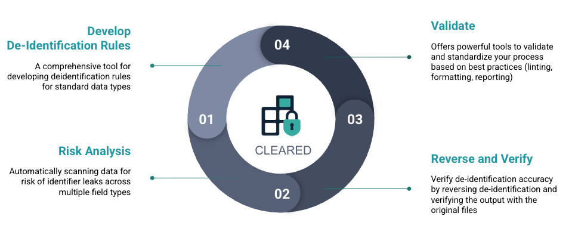

# Cleared Documentation

<div align="center">
  
</div>

> Share data for scientific research confidently.

Welcome to the Cleared documentation! This documentation will help you understand how to use Cleared to de-identify healthcare and research data while maintaining clinical integrity and research utility.

<div align="center">
  
</div>

## What is Cleared?

**Cleared** is an open-source multi-purpose de-identification library with special support for healthcare applications. It provides robust tools to de-identify **multi-table, multimodal** datasets while maintaining clinical integrity and research utility.

Cleared supports:
- Multiple identifiers (SSN, Encounter Id, MRN, FIN, etc.) in the same tables
- Time-field de-identification
- Patient-aware de-identification across multiple encounters (visits)
- Date and time de-identification at both column-level and row value level
- Support for time-series data such as multi-variate sparsely sampled data types and high-frequency waveforms
- Predefined configurations for standard schemas such as [OMOP CDM](https://www.ohdsi.org/data-standardization/)

## Quick Navigation

### 🚀 Getting Started

New to Cleared? Start here:

1. **[Quickstart](quickstart.md)** - Get started with the de-identification workflow
2. **[Single Table Example](use_cleared_config.md)** - Learn de-identification with YAML configs and CLI
3. **[Describe: Review De-identification Configuration](use_describe.md)** - Generate and review HTML configuration reports

### 📖 Core Concepts

Learn the fundamental concepts:

4. **[Multi-table De-identification](multi_table_pipeline_config.md)** - Handle related tables with consistent de-identification
5. **[Rerun De-identification with Consistency](rerun_deidentification_consistency.md)** - Maintain consistency when adding new data
6. **[Reversing De-identification](reverse.md)** - Restore original values from de-identified data
7. **[Verify De-identification Results](verify-deid-results.md)** - Verify reversed data integrity and generate HTML reports
8. **[UIDs de-identification](group-level-id-deidentification.md)** - De-identify group-level identifiers

### 🛠️ Reference Guides

Detailed reference documentation:

9. **[CLI Usage Guide](cli-usage.md)** - Complete command-line interface reference
10. **[Linting Rules Reference](linting_rules.md)** - Complete reference for all configuration linting rules
11. **[Date and Time Shifting](date-and-time-shifting.md)** - Detailed guide on temporal de-identification
12. **[Using the Python API](using_the_python_api.md)** - De-identification using Python API directly

### 🔬 Advanced Topics

Explore advanced features:

13. **[Free-text PHI Detection](phi-detection.md)** - Detect PHI in free-text fields
14. **[Logging and Auditing](logging-and-auditing.md)** - Configure logging and audit trails
15. **[Healthcare Schema Support](healthcare-schema-support.md)** - Built-in support for healthcare schemas
16. **[Custom Transformers Plugins](custom-transformers-plugins.md)** - Create custom de-identification transformers

### 🤝 Contributing

17. **[Contributing](contributing.md)** - How to contribute to Cleared
18. **[Release Process](release.md)** - Guide for creating and publishing releases

## Learning Paths

### For First-Time Users

1. Start with the **[Quickstart](quickstart.md)** to understand the basic workflow
2. Follow the **[Single Table Example](use_cleared_config.md)** to create your first configuration
3. Use **[Describe: Review De-identification Configuration](use_describe.md)** to review your configuration
4. Learn about **[Multi-table De-identification](multi_table_pipeline_config.md)** for complex scenarios

### For Healthcare Data Engineers

1. Review **[Healthcare Schema Support](healthcare-schema-support.md)** for schema-specific guidance
2. Understand **[Date and Time Shifting](date-and-time-shifting.md)** for temporal data
3. Explore **[UIDs de-identification](group-level-id-deidentification.md)** for patient-level identifiers
4. Check **[CLI Usage Guide](cli-usage.md)** for production workflows

### For Python Developers

1. Start with **[Using the Python API](using_the_python_api.md)** for programmatic usage
2. Review **[Custom Transformers Plugins](custom-transformers-plugins.md)** to extend functionality
3. Explore the API reference for detailed transformer documentation

## Key Features

Cleared provides comprehensive de-identification capabilities:

- ✅ **Multi-table Support** - Consistent ID mapping across EHR tables
- ✅ **Multi-ID Support** - Handle multiple identifiers in the same tables
- ✅ **Date & Time Shifting** - Preserve clinical event intervals
- ✅ **Schema-aware Configs** - Built-in support for HL7, OMOP, and FHIR-like schemas
- ✅ **Pseudonymization Engine** - Deterministic, reversible pseudonyms
- ✅ **Reverse De-identification** - Restore original values using reference mappings
- ✅ **Verify De-identification** - Comprehensive verification with HTML reports
- ✅ **Configuration Reusability** - Leverage Hydra configuration system

## Compliance Support

Cleared is designed to assist with developing de-identification pipelines to reach compliance under:

- **HIPAA** (Safe Harbor & Expert Determination)
- **GDPR** (Anonymization & Pseudonymization)
- **21 CFR Part 11** (Audit Trails)

> ⚠️ **Important:** Cleared is a toolkit — not a certification engine. Regulatory compliance remains **user-dependent** and must be validated within your organization's governance and compliance framework.

## Installation

Install Cleared using pip:

```bash
pip install cleared
```

For development installation, see the [Contributing](contributing.md) guide.

## Need Help?

- 📖 Browse the tutorials above to learn step-by-step
- 🔍 Check the [CLI Usage Guide](cli-usage.md) for command reference
- 📋 Review [Linting Rules Reference](linting_rules.md) for configuration validation
- 💬 Open an issue on [GitHub](https://github.com/nomaai/cleared/issues) for questions

---

**Ready to get started?** Begin with the [Quickstart Guide](quickstart.md)!
