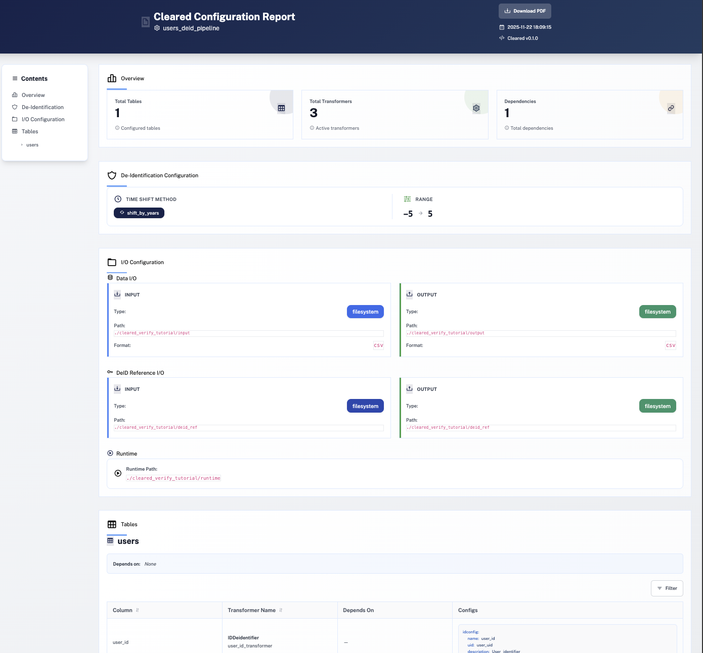
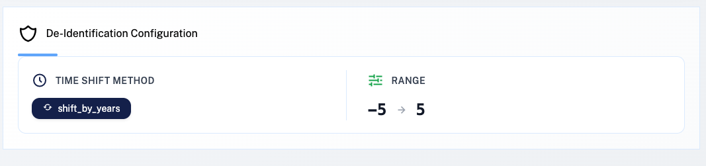
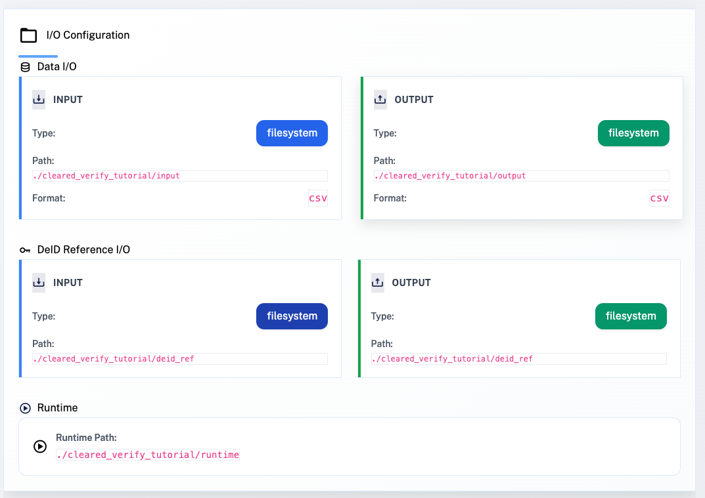
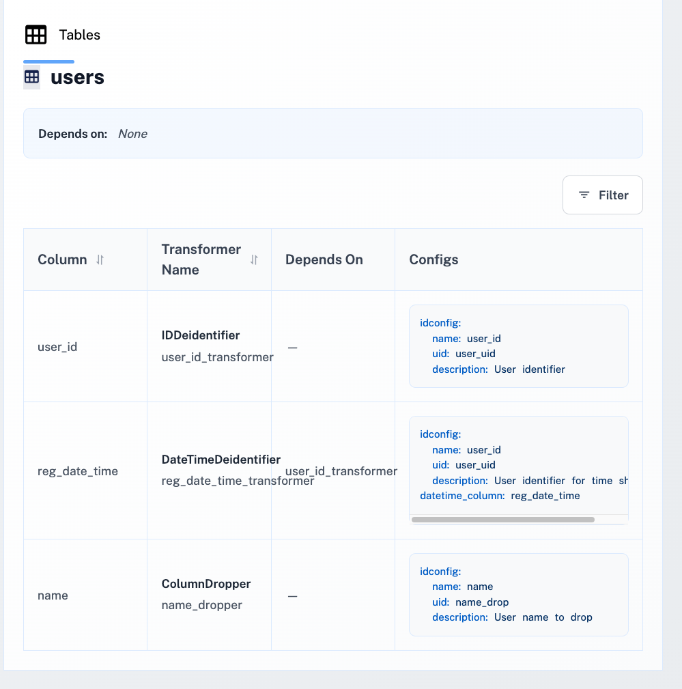

# Describe: Review De-identification Configuration

This guide explains how to generate and review an HTML report of your de-identification configuration using the `cleared describe` command. This report helps you visualize and understand your entire de-identification setup before running the pipeline.

## Overview

The `cleared describe` command generates a comprehensive HTML report that visualizes your entire de-identification configuration. This report is useful for:

- **Reviewing configuration** - Understand what de-identification rules are applied to each table
- **Documentation** - Share configuration details with team members or stakeholders
- **Auditing** - Verify that all expected transformers and dependencies are configured
- **Troubleshooting** - Identify configuration issues before running the pipeline

<div align="center">
  
</div>
<br>

## Prerequisites: Create Example Config

Save the following config in users-config.html:

```yaml
name: "users_deid_pipeline"
deid_config:
  time_shift:
    method: "shift_by_years"
    min: -5
    max: 5
io:
  data:
    input_config:
      io_type: "filesystem"
      configs:
        base_path: "/Users/Salim/Desktop/Test/cleared_verify_tutorial/input"
        file_format: "csv"
    output_config:
      io_type: "filesystem"
      configs:
        base_path: "/Users/Salim/Desktop/Test/cleared_verify_tutorial/output"
        file_format: "csv"
  deid_ref:
    input_config:
      io_type: "filesystem"
      configs:
        base_path: "/Users/Salim/Desktop/Test/cleared_verify_tutorial/deid_ref"
    output_config:
      io_type: "filesystem"
      configs:
        base_path: "/Users/Salim/Desktop/Test/cleared_verify_tutorial/deid_ref"
  runtime_io_path: "/Users/Salim/Desktop/Test/cleared_verify_tutorial/runtime"
tables:
  users:
    name: "users"
    depends_on: []
    transformers:
      - method: "IDDeidentifier"
        uid: "user_id_transformer"
        depends_on: []
        configs:
          idconfig:
            name: "user_id"
            uid: "user_uid"
            description: "User identifier"
      - method: "DateTimeDeidentifier"
        uid: "reg_date_time_transformer"
        depends_on: ["user_id_transformer"]
        configs:
          idconfig:
            name: "user_id"
            uid: "user_uid"
            description: "User identifier for time shifting"
          datetime_column: "reg_date_time"
      - method: "ColumnDropper"
        uid: "name_dropper"
        depends_on: []
        configs:
          idconfig:
            name: "name"
            uid: "name_drop"
            description: "User name to drop"

```

Create a configuration file `users_config.yaml` (see [Single Table Example](use_cleared_config.md) for the complete configuration).

## Step 1: Generate Configuration Report

Generate a configuration report with the `cleared describe` command:

```bash
cleared describe users_config.yaml
```

This creates an HTML file named `describe.html` in the current directory.

### Command Options

- `-o, --output`: Custom output file path (default: `describe.html` in current directory)
- `--config-name, -cn`: Name of the configuration to load (default: `cleared_config`)
- `--override`: Override configuration values before generating report
- `--verbose, -v`: Enable verbose output

### Custom Output Path

Specify a custom output file:

```bash
cleared describe users_config.yaml -o config-report.html
```

Or specify a full path:

```bash
cleared describe users_config.yaml -o /path/to/reports/config-report.html
```

## Step 2: Understanding the Report

Open the generated HTML file in your browser to view the comprehensive configuration report.

### Full Report View

The report provides a complete overview of your configuration:
<div align="center">
  
</div>

### 1. Overview Statistics

The top section provides high-level statistics:

- **Total Tables** - Number of tables in the configuration
- **Total Transformers** - Total number of transformers across all tables
- **Total Dependencies** - Total number of dependency relationships
- **Configuration Name** - Name of the configuration

<div align="center">
  
</div>

### 2. De-identification Configuration

This section shows global de-identification settings:

- **Time Shift Method** - The method used for datetime de-identification (e.g., `shift_by_years`, `shift_by_weeks`)
- **Time Shift Range** - Minimum and maximum values for time shifting (e.g., `-5` to `5` years)

<div align="center">
  
</div>

### 3. I/O Configuration

Displays input/output settings:

- **Data Input/Output** - Paths and formats for reading and writing data files
- **De-identification Reference** - Paths for storing de-identification mappings
- **Runtime Path** - Temporary file storage location

<div align="center">
  
</div>

### 4. Tables Section

The main section lists all tables with detailed transformer information:

For each table, you'll see:

- **Table Name** - The name of the table
- **Dependencies** - Other tables this table depends on
- **Transformers** - List of all transformers applied to this table

For each transformer:

- **Method** - Transformer type (e.g., `IDDeidentifier`, `DateTimeDeidentifier`, `ColumnDropper`)
- **UID** - Unique identifier for the transformer
- **Column** - The column being de-identified
- **Dependencies** - Other transformers this transformer depends on
- **Configuration** - Detailed configuration settings

<div align="center">
  
</div>

## Use Cases

The configuration report is particularly useful for:

- **Before Running Pipeline** - Review your configuration to ensure all settings are correct
- **Team Collaboration** - Share the HTML report with team members for review
- **Documentation** - Keep a record of your de-identification configuration
- **Audit Trail** - Maintain documentation of what transformations are applied
- **Troubleshooting** - Identify missing or incorrect transformer configurations

## Best Practices

1. **Generate Before First Run** - Always generate and review the configuration report before running de-identification on production data
2. **Version Control** - Save the HTML reports alongside your configuration files for version tracking
3. **Team Review** - Use the report for team reviews to ensure all stakeholders understand the de-identification approach
4. **Compare Configurations** - Generate reports for different configurations to compare approaches

## Next Tutorial

Continue to the next tutorial: [Multi-table De-identification](multi_table_pipeline_config.md) - Handle related tables with consistent de-identification
