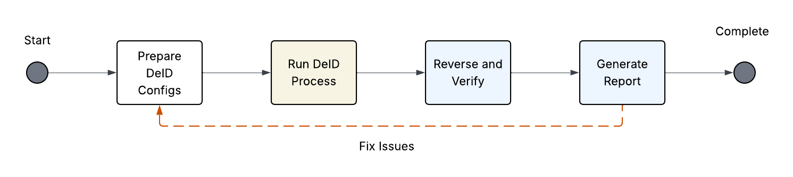
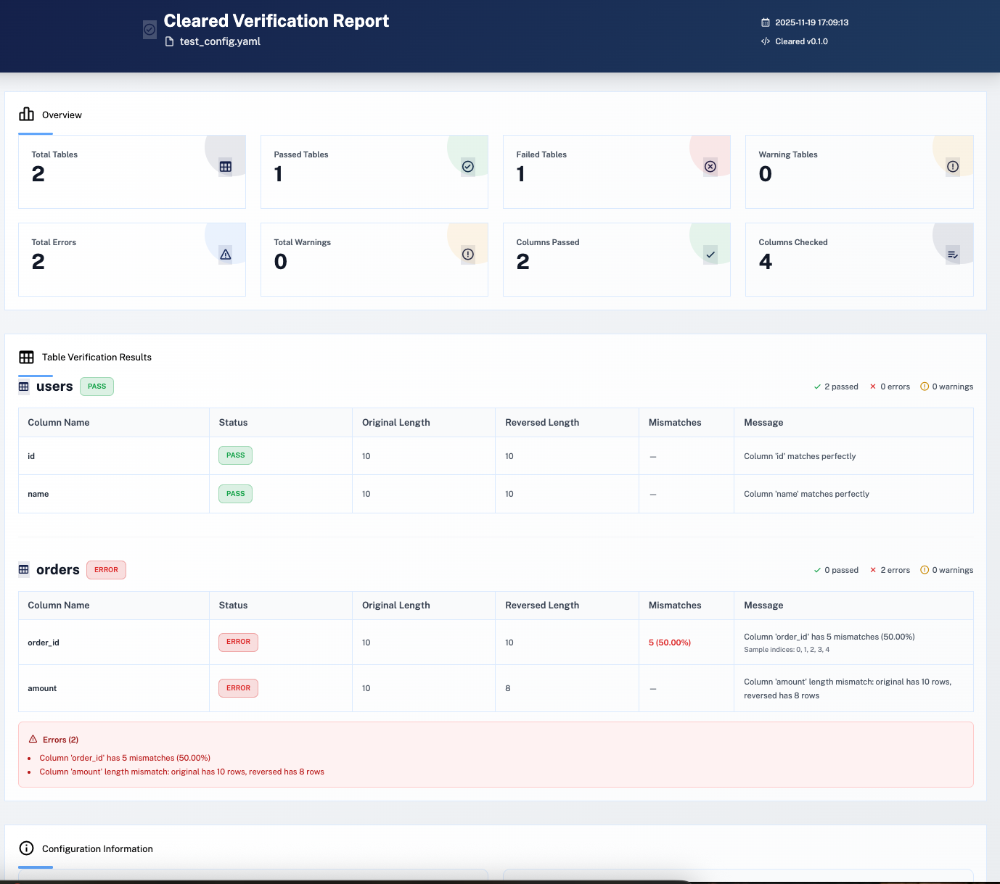

# Verify and Report Commands

The Cleared framework provides commands to verify that reversed de-identification data matches the original data, and to generate comprehensive HTML reports of verification results.

## Table of Contents

- [Overview](#overview)
- [`cleared verify`](#cleared-verify)
  - [Usage](#usage)
  - [Arguments](#arguments)
  - [Options](#options)
  - [Description](#description)
  - [Examples](#examples)
  - [Output Format](#output-format)
- [`cleared report-verify`](#cleared-report-verify)
  - [Usage](#usage-1)
  - [Arguments](#arguments-1)
  - [Options](#options-1)
  - [Description](#description-1)
  - [Examples](#examples-1)
  - [Report Features](#report-features)
- [Verification Process](#verification-process)
- [Understanding Verification Results](#understanding-verification-results)
- [Best Practices](#best-practices)
- [Troubleshooting](#troubleshooting)

## Overview

Combined with the reverse function, the verification tool can be a easy and powerful tool to verify that the deidentification is done properly and its reversable using the deied maps. It supports:

1. **Verify data was reversed correctly** - Compare original data with reversed de-identification results to ensure data integrity
2. **Generate reports** - Create detailed HTML reports showing verification results with statistics and per-table comparisons

This is particularly useful when:
- Testing the reverse functionality of transformers
- Validating that de-identification can be reversed correctly
- Auditing data integrity after reverse operations
- Documenting verification results for compliance


<div align="center">
  
</div>

## Example Report

<div align="center">
  
</div>

## `cleared verify`

Verify that reversed data matches the original data by comparing corresponding files.

### Usage

```bash
cleared verify <config.yaml> <reverse_data_path> [OPTIONS]
```

### Arguments

- `config.yaml` - Path to the configuration file used for the original de-identification
- `reverse_data_path` - Path to the directory containing the reversed data output

### Options

- `--output`, `-o` - Path to save JSON verification results (default: verify-results.json in current directory)
- `--verbose`, `-v` - Enable verbose output with detailed progress information

### Description

The `cleared verify` command performs a comprehensive comparison between your original data and the reversed data. It:

1. **Loads the configuration** to understand the original data structure
2. **Reads original data** from the input paths specified in the configuration
3. **Reads reversed data** from the provided reverse data path
4. **Compares each table** column by column, checking:
   - Column existence (original vs reversed)
   - Row count consistency
   - Value-by-value matching
   - Handling of dropped columns
5. **Generates results** in JSON format with detailed statistics

The verification process handles:
- **Missing columns** - Detects if columns are missing in reversed data (errors or warnings based on ColumnDropper configuration)
- **Length mismatches** - Identifies when original and reversed data have different row counts
- **Value mismatches** - Compares each value index-by-index, handling NaN values correctly
- **Sample indices** - Provides up to 100 sample indices where mismatches occur

### Examples

```bash
# Basic verification
cleared verify config.yaml ./reversed_data

# Save results to custom location
cleared verify config.yaml ./reversed_data -o results/verification.json

# Verbose output for debugging
cleared verify config.yaml ./reversed_data --verbose

# Verify with custom output path
cleared verify config.yaml /path/to/reversed/output -o /path/to/results.json
```

### Output Format

The verification command generates a JSON file with the following structure:

```json
{
  "overview": {
    "total_tables": 2,
    "passed_tables": 1,
    "failed_tables": 1,
    "warning_tables": 0,
    "total_errors": 2,
    "total_warnings": 0,
    "total_columns_checked": 4,
    "total_columns_passed": 2,
    "total_columns_errored": 2,
    "total_columns_warned": 0
  },
  "tables": [
    {
      "table_name": "users",
      "status": "pass",
      "total_columns": 2,
      "passed_columns": 2,
      "error_columns": 0,
      "warning_columns": 0,
      "errors": [],
      "warnings": [],
      "column_results": [
        {
          "column_name": "id",
          "status": "pass",
          "message": "Column 'id' matches perfectly",
          "original_length": 10,
          "reversed_length": 10,
          "mismatch_count": 0,
          "mismatch_percentage": 0.0,
          "sample_mismatch_indices": []
        }
      ]
    }
  ],
  "config_path": "config.yaml",
  "reverse_data_path": "./reversed_data"
}
```

**Overview Fields:**
- `total_tables` - Total number of tables checked
- `passed_tables` - Number of tables that passed verification
- `failed_tables` - Number of tables that failed verification
- `warning_tables` - Number of tables with warnings
- `total_errors` - Total number of errors across all tables
- `total_warnings` - Total number of warnings across all tables
- `total_columns_checked` - Total number of columns verified
- `total_columns_passed` - Number of columns that passed
- `total_columns_errored` - Number of columns with errors
- `total_columns_warned` - Number of columns with warnings

**Table Fields:**
- `table_name` - Name of the table
- `status` - Overall status: "pass", "error", or "warning"
- `total_columns` - Total columns in the table
- `passed_columns` - Number of columns that passed
- `error_columns` - Number of columns with errors
- `warning_columns` - Number of columns with warnings
- `errors` - List of error messages
- `warnings` - List of warning messages
- `column_results` - Detailed results for each column

**Column Result Fields:**
- `column_name` - Name of the column
- `status` - Column status: "pass", "error", or "warning"
- `message` - Human-readable message describing the result
- `original_length` - Number of rows in original data
- `reversed_length` - Number of rows in reversed data
- `mismatch_count` - Number of mismatched values
- `mismatch_percentage` - Percentage of mismatched values
- `sample_mismatch_indices` - Sample indices where mismatches occur (up to 100)

## `cleared report-verify`

Generate an HTML report from verification JSON results.

### Usage

```bash
cleared report-verify <verify.json> [OPTIONS]
```

### Arguments

- `verify.json` - Path to the verification JSON file (generated by `cleared verify`)

### Options

- `--output`, `-o` - Output HTML file path (default: verify-report.html in current directory)
- `--verbose`, `-v` - Enable verbose output

### Description

The `cleared report-verify` command takes a verification JSON file (generated by `cleared verify`) and creates a comprehensive, visually appealing HTML report. The report includes:

- **Overview Statistics** - High-level metrics in easy-to-read stat cards
- **Per-Table Results** - Detailed tables showing column-by-column comparison results
- **Status Indicators** - Color-coded badges for pass/error/warning status
- **Error and Warning Lists** - Detailed lists of issues found during verification
- **Configuration Information** - Paths and settings used for verification

The HTML report uses a professional theme matching the Cleared framework design and is suitable for:
- Sharing with stakeholders
- Documentation and compliance
- Debugging verification issues
- Archiving verification results

### Examples

```bash
# Generate report from verification results
cleared report-verify verify-results.json

# Generate report with custom output path
cleared report-verify verify-results.json -o reports/verification-report.html

# Generate report with verbose output
cleared report-verify verify-results.json -o report.html --verbose

# Generate report from custom location
cleared report-verify /path/to/verify-results.json -o /path/to/report.html
```

### Report Features

The HTML report includes:

1. **Overview Section**
   - Total Tables (with icon)
   - Passed Tables (with success indicator)
   - Failed Tables (with error indicator)
   - Warning Tables (with warning indicator)
   - Total Errors
   - Total Warnings
   - Columns Passed
   - Columns Checked

2. **Table Verification Results**
   - One section per table with:
     - Table name and overall status badge
     - Summary statistics (passed/error/warning columns)
     - Detailed comparison table with columns:
       - Column Name
       - Status (pass/error/warning badge)
       - Original Length
       - Reversed Length
       - Mismatches (count and percentage)
       - Message
       - Sample mismatch indices (if applicable)
     - Error list (if any errors)
     - Warning list (if any warnings)

3. **Configuration Information**
   - Config path used for verification
   - Reverse data path
   - Source JSON file path

## Verification Process

The verification process follows these steps:

1. **Load Configuration** - Reads the original configuration file to understand data structure
2. **Identify Tables** - Determines which tables need to be verified
3. **For Each Table:**
   - Load original data from input paths
   - Load reversed data from reverse data path
   - Compare column by column:
     - Check if column exists in both datasets
     - Compare row counts
     - Compare values index-by-index
     - Handle NaN values correctly
     - Track mismatches and sample indices
4. **Generate Results** - Creates JSON output with comprehensive statistics
5. **Report Generation** - (Optional) Generate HTML report from JSON results

### Column Comparison Logic

The verification uses the following logic for each column:

1. **Missing Column Check:**
   - If column exists in original but not in reversed:
     - If ColumnDropper was used → Warning
     - Otherwise → Error

2. **Length Check:**
   - If original and reversed lengths differ → Error

3. **Value Comparison:**
   - Compare values index-by-index
   - Handle NaN values (NaN == NaN is considered a match)
   - Track mismatches and calculate percentage
   - Store up to 100 sample mismatch indices

## Understanding Verification Results

### Status Meanings

- **pass** - Column/table matches perfectly between original and reversed data
- **error** - Critical mismatch found (missing column, length mismatch, or value mismatches)
- **warning** - Expected difference (e.g., column was dropped by ColumnDropper)

### Common Scenarios

**Perfect Match:**
```json
{
  "status": "pass",
  "message": "Column 'id' matches perfectly",
  "mismatch_count": 0,
  "mismatch_percentage": 0.0
}
```

**Value Mismatches:**
```json
{
  "status": "error",
  "message": "Column 'name' has 5 mismatches (50.00%)",
  "mismatch_count": 5,
  "mismatch_percentage": 50.0,
  "sample_mismatch_indices": [0, 1, 2, 3, 4]
}
```

**Length Mismatch:**
```json
{
  "status": "error",
  "message": "Column 'amount' length mismatch: original has 10 rows, reversed has 8 rows",
  "original_length": 10,
  "reversed_length": 8
}
```

**Dropped Column:**
```json
{
  "status": "warning",
  "message": "Column 'temp_col' was dropped by ColumnDropper and is expected to be missing in reversed data",
  "original_length": 10,
  "reversed_length": 0
}
```

## Best Practices

1. **Always verify after reverse operations:**
   ```bash
   cleared reverse config.yaml ./reversed_output
   cleared verify config.yaml ./reversed_output
   ```

2. **Save verification results:**
   ```bash
   cleared verify config.yaml ./reversed_output -o verification-results.json
   ```

3. **Generate reports for documentation:**
   ```bash
   cleared verify config.yaml ./reversed_output -o results.json
   cleared report-verify results.json -o verification-report.html
   ```

4. **Use verbose mode for debugging:**
   ```bash
   cleared verify config.yaml ./reversed_output --verbose
   ```

5. **Review both JSON and HTML outputs:**
   - JSON for programmatic analysis
   - HTML for human-readable reports

6. **Version control verification results:**
   - Commit JSON results for audit trails
   - Generate HTML reports for documentation

## Troubleshooting

### Common Issues

**"Column exists in original but is missing in reversed data"**
- **Cause:** Column may have been dropped by ColumnDropper, or reverse operation failed
- **Solution:** Check if ColumnDropper was used for this column. If not, investigate reverse operation.

**"Length mismatch"**
- **Cause:** Original and reversed data have different row counts
- **Solution:** Check if reverse operation processed all rows correctly. Verify no data was filtered or lost.

**"Value mismatches"**
- **Cause:** Reverse operation didn't perfectly restore original values
- **Solution:** Review transformer reverse implementations. Check for floating-point precision issues or rounding errors.

**"Cannot load original data"**
- **Cause:** Original data path doesn't exist or is inaccessible
- **Solution:** Verify input paths in configuration file. Check file permissions.

**"Cannot load reversed data"**
- **Cause:** Reverse data path doesn't exist or is incorrect
- **Solution:** Verify reverse data path. Ensure reverse operation completed successfully.

### Debugging Tips

1. **Use verbose mode:**
   ```bash
   cleared verify config.yaml ./reversed_output --verbose
   ```

2. **Check individual tables:**
   - Review table-specific results in JSON output
   - Look at sample mismatch indices to identify patterns

3. **Verify data paths:**
   - Ensure original data paths in config are correct
   - Verify reverse data path exists and contains expected files

4. **Review transformer configurations:**
   - Check if transformers support reverse operations
   - Verify transformer configurations are correct

5. **Compare file formats:**
   - Ensure original and reversed data use same file format
   - Check for encoding issues

## Integration with Workflow

The verify and report commands integrate seamlessly with the Cleared workflow:

```bash
# 1. Run de-identification
cleared run config.yaml

# 2. Reverse the de-identification
cleared reverse config.yaml ./reversed_output

# 3. Verify the reversed data
cleared verify config.yaml ./reversed_output -o verify-results.json

# 4. Generate HTML report
cleared report-verify verify-results.json -o verification-report.html
```

This workflow ensures data integrity and provides comprehensive documentation of the verification process.

