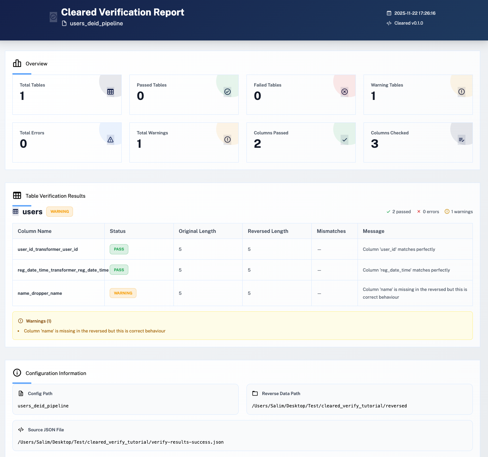
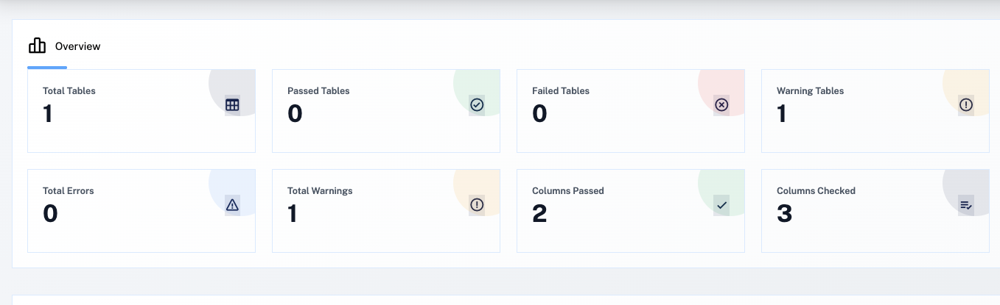
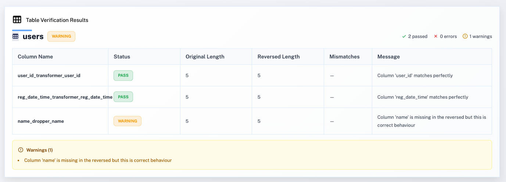
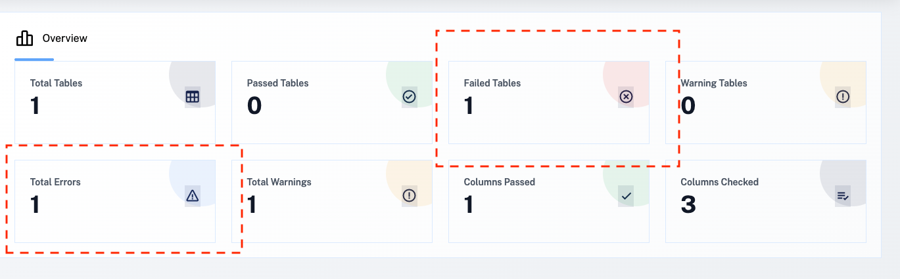
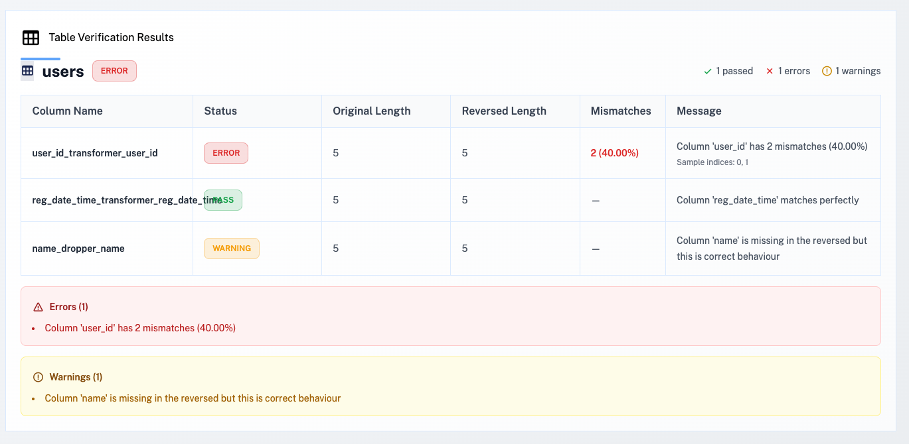

# Verify De-identification Results

This guide covers how to verify that your de-identification process works correctly by reversing the de-identified data and comparing it with the original data. This is an essential step to ensure data integrity and that the de-identification process is reversible. A more detailed documentation of the tool, its output and usage can be found at [Detailed Verify Documentation](verify-documentation.md).

## Overview

The verification workflow consists of three main steps:

1. **Reverse De-identification** - Restore original values from de-identified data
2. **Verify Results** - Compare original and reversed data to ensure they match
3. **Generate Report** - Create an HTML report of verification results

## Prerequisites

Before verifying, you need to have:
1. Completed de-identification (using `cleared run`)
2. De-identification reference files in the `deid_ref` directory

For this tutorial, we'll use sample data. First, create the sample data and configuration:

```python
import cleared as clr
import pandas as pd
from datetime import datetime

# Get sample users data
users_df = clr.sample_data.users_single_table
users_df.to_csv('input/users.csv', index=False)
print("Created input/users.csv")
```

Then run de-identification:

```bash
cleared run users_config.yaml
```

## Step 1: Reverse De-identification to Verify Correctness

Reverse the de-identification to verify it works correctly. You need to give it a path for its output:

```bash
cleared reverse users_config.yaml --output ./reversed
```

This command:
- Reads the de-identified data from the output directory
- Loads the de-identification reference mappings
- Applies reverse transformations to restore original values
- Writes the reversed data to the specified output directory

### Command Options

- `-o, --output`: **Required**. Directory path where reversed data will be written
- `--continue-on-error, -c`: Continue running remaining pipelines even if one fails
- `--create-dirs, -d`: Create missing directories automatically
- `--verbose, -v`: Enable verbose output
- `--config-name, -cn`: Name of the configuration to load (default: `cleared_config`)
- `--override`: Override configuration values

> ⚠️ **Note**: The reverse process requires the de-identification reference files that were created during the initial de-identification run. Make sure these files are available in the `deid_ref` directory specified in your configuration.

## Step 2: Verify Results

Verify that reversed data matches the original accurately after reversing:

```bash
cleared verify users_config.yaml ./reversed -o verify-results.json
```

### Output

The verification generates a JSON file (`verify-results.json`) containing:
- Overall verification status
- Per-table comparison results
- Column-by-column matching details
- Mismatch statistics and sample indices

### All Tests Pass

If all verification checks pass:
- ✅ Original and reversed data match exactly
- ✅ De-identification is reversible
- ✅ Data integrity is maintained
- ✅ Ready to proceed with real data


### Example Output (Success)

```
============================================================
Verification Results
============================================================

📊 Overview:
  Total Tables: 1
  ✅ Passed: 1
  ❌ Failed: 0
  ⚠️  Warnings: 1
  Total Errors: 0
  Total Warnings: 1

📋 Per-Table Results:

  ✅ Table: users (pass)
     Columns: 2 passed, 0 errors, 1 warnings
     Warnings (1):
       - Column 'name' was dropped by ColumnDropper transformer

💾 Results saved to: verify-results.json

✅ All verifications passed!
```

### Example Output (Error)

If there are mismatches in the verification, you'll see an output like below. In this example, the `user_id` column has mismatches, indicating that the reverse process didn't correctly restore the original values.

```
============================================================
Verification Results
============================================================

📊 Overview:
  Total Tables: 1
  ✅ Passed: 0
  ❌ Failed: 1
  ⚠️  Warnings: 1
  Total Errors: 1
  Total Warnings: 1

📋 Per-Table Results:

  ❌ Table: users (error)
     Columns: 1 passed, 1 errors, 1 warnings
     Errors (1):
       - Column 'user_id' has 2 mismatches (40.00%)
     Warnings (1):
       - Column 'name' was dropped by ColumnDropper transformer

💾 Results saved to: verify-results.json
```

This indicates that 2 out of 5 rows in the `user_id` column don't match between the original and reversed data, which suggests an issue with the de-identification or reverse process.

## Step 3: Generate Report

You can also use the HTML reports for usability to review the output of the verification which also provides more details.

```bash
cleared report-verify verify-results.json -o verification-report.html
```

> **Note**: To generate the HTML reports shown in the examples below, run the `cleared report-verify` command after completing the verification step. The HTML files can then be opened in a browser to view the detailed verification results.

### Success Example

The HTML report includes:
You'll see the results in a report html page like below:
<div align="center">
  
</div>

<br><br>
The top section will show the overall results:
<div align="center">
  
</div>

<br><br>
It will then be followed with table specific results:
<div align="center">
  
</div>

### Failure Example - Same Allergy Case

In the error example, the top section will show the overall statistics and failures:
<div align="center">
  
</div>

<br><br>
While you can find the specific of the error in the table-specific sections:
<div align="center">
  
</div>


## Understanding Verification Results

The verification process compares the original data with the reversed data column by column, checking:

- **Column Existence**: Ensures all original columns are present in reversed data (or properly dropped)
- **Row Count Consistency**: Verifies that the number of rows matches between original and reversed data
- **Value Matching**: Compares each value index-by-index, handling NaN values correctly
- **Sample Indices**: Provides up to 100 sample indices where mismatches occur (if any)

### Status Types

- **Pass**: All values match perfectly
- **Error**: Mismatches found that indicate a problem with the de-identification or reversal process
- **Warning**: Expected differences (e.g., columns that were intentionally dropped)

## Troubleshooting

If verification fails:

1. **Check De-identification Reference Files**: Ensure all reference mapping files exist in the `deid_ref` directory
2. **Verify Configuration**: Make sure the same configuration file is used for both de-identification and reverse
3. **Check for ColumnDropper**: Remember that `ColumnDropper` transformer is not reversible - dropped columns cannot be restored
4. **Review Error Details**: The verification report will show specific columns and rows where mismatches occur
5. **Check Data Types**: Ensure data types are consistent between original and reversed data

## Next Tutorial

Continue to the next tutorial: [UIDs de-identification](group-level-id-deidentification.md)

